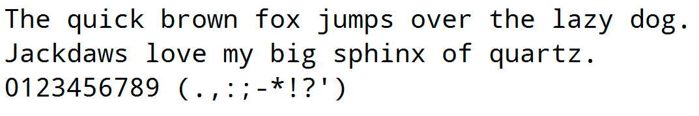
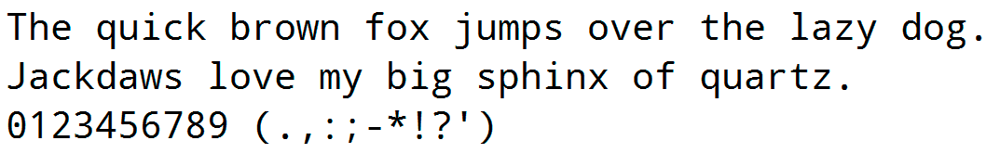
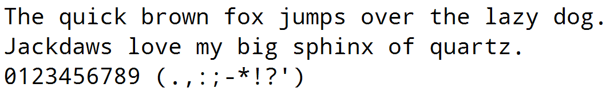

Droid Sans Mono ZeroMod
=======================

Droid Sans Mono is a great font for programming but the zero character lacks a dot or a slash to be perfect.

I've made two modified versions of the [original font](http://www.fontsquirrel.com/fonts/droid-sans-mono), one with a dotted zero and another with a slashed zero.

There are similar versions in [Cosmix.org](http://www.cosmix.org/software/), but they has less line spacing than the original. Try these if you like a more condensed code.

**Droid Sans Mono (Original)**

**Droid Sans Mono Dotted**

**Droid Sans Mono Slashed**

